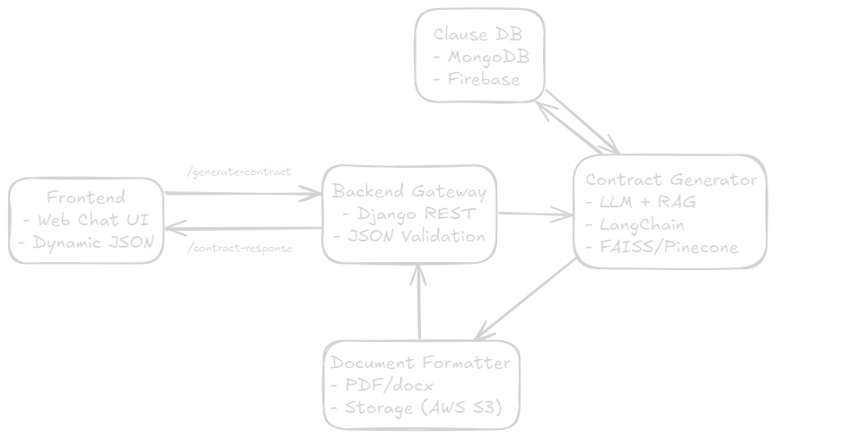

# Legal-Gen-RAG 🧾🤖

**AI-powered microservice architecture for automated legal document generation.**

This project aims to provide a complete end-to-end backend pipeline for dynamically generating real estate contracts using LLMs + Retrieval-Augmented Generation (RAG) + Clean API design.

---

## Architecture Overview

This project is structured as a microservice-based system:

- **Contract Generator API**: Built with Django REST, handles contract input validation and service routing.
- **Clause Database**: Stores legal clauses (MongoDB or Firebase) used as contextual documents for RAG.
- **RAG Pipeline**: LangChain with FAISS or Pinecone, feeding the LLM to generate customized contracts.
- **Document Formatter**: Converts output into `.docx` or `.pdf` using Python libraries.
- **Storage Layer**: Local or AWS S3 for contract file management.
- **(Future)**: React-based chatbot UI for natural interaction.



---

## Example Flow

1. User fills dynamic JSON (via frontend or direct POST)
2. Backend validates and forwards request to contract generation module
3. RAG searches and retrieves appropriate legal clauses
4. LLM composes a full contract using both inputs and clauses
5. A formatted `.docx` is generated and returned for download

---

## Current Features (MVP in progress)

- [x] Initial Django project and REST API skeleton
- [ ] Input schema for real estate rental contracts
- [ ] LangChain integration for RAG
- [ ] Clause collection management
- [ ] Document generation
- [ ] Docker + CI/CD pipeline setup
- [ ] Example contracts and test routes

---

## Tech Stack

| Layer | Tools |
|-------|-------|
| Backend API | Django + Django REST Framework |
| Vector DB | FAISS (or Pinecone) |
| IA Pipeline | LangChain + OpenAI/GPT |
| Storage | AWS S3 |
| Document | python-docx / WeasyPrint |
| Infra | Docker, GitHub Actions |

---

## Local Setup

```bash
git clone https://github.com/JoaoSalenave/legal-gen-rag.git
cd legal-gen-rag
docker-compose up --build